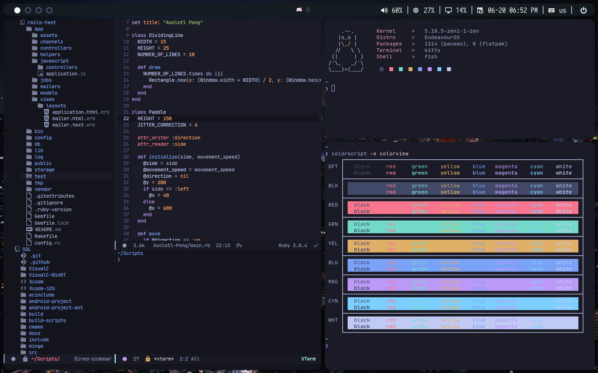

# Dotfiles
These are some of my dotfiles.

NOTE: Dotfiles may consistently update.

COMING SOON: install.sh

# Dependencies
You will at least need:

* Iosevka Nerd Font
* JetBrainsMono Nerd Font
* Fish Shell and Oh my Fish with the pure theme installed (https://github.com/pure-fish/pure)
* Dunst
* Picom
* BSPWM & SXHKD
* Emacs with Doom Emacs installed (https://github.com/doomemacs/doomemacs)
* Elcord Emacs package installed for a Discord Rich Presence status that shows what you're editing
* Dired-sidebar Emacs package installed for the sidebar that shows what files are in the directory you're in (optional) 
* Polybar
* Macchina
* feh or nitrogen

NOTE: You may have to edit the `sxhkdrc` file based off of what you use for web browser, terminal emulator, and program launcher.

# Installation
To install the dotfiles, put them in the directories they need to go in (all should be located in `.config`, execpt for the Doom Emacs config, which goes in `.doom.d`). You may have to `chmod +x` the `bspwmrc` and `sxhkd` files.
